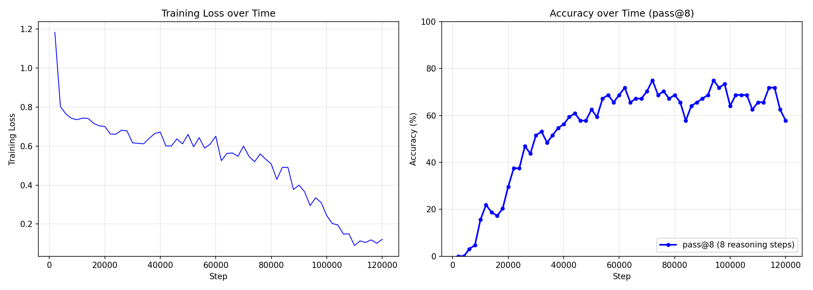
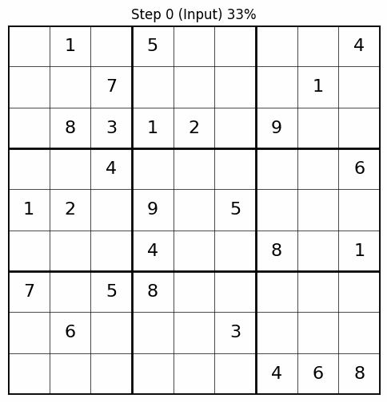

# URM Sudoku

A simplified implementation of the **Universal Reasoning Model (URM)** for solving the Extreme Sudoku Challenge.

** ! checkpoints will be uploaded to Hugging Face Soon ...

## Overview

The URM architecture is a reasoning-first architecture that learns to solve logical puzzles through iterative reasoning (8 steps). 

**Key Advantages:**
- Only **~14 million parameters** required to reach 75% accuracy on Sudoku Extreme
- Outperforms larger Transformer language models by a significant margin in terms of GPU memory usage (up to ~100x less memory)
- Note: 100x memory reduction does not mean 100x faster inference. Expect approximately a 8x speed-up factor, as the model still performs significant computation but with fewer parameters. (Not really measured, assumed from the Research Papers)

## Results

After 100k training steps: **75% accuracy** (75% chance the AI solves the Sudoku puzzle completely).

Training time: 
* ~11 hours on a RTX 5060 Ti
* ~2.5 hours on a RTX 5090 

### Training Progress



### Example: AI Solving a Sudoku



## Changelog

### v2 - 22.02.2026
- Removed Confusing Metrics
- Retrained on a RTX 5090 32GB

### v1 - 01.01.2026
- Muon Optimizer
- BF16 Training

## Installation

**Requirements:** PyTorch 2.9 or higher

```bash
pip install -r requirements.txt
```

## Training from Scratch

1. Remove the following folders to start fresh:
   - `checkpoints/`
   - `graphs/`
   - `results/`

2. Run the training script:

**Linux:**
```bash
bash ./2_train_URM_Sudoku.sh
```

**Windows/Linux:**
```bash
python ./2_train_URM_Sudoku.py --lr_from 1e-4 --lr_to 3e-5 --steps 100000
```

**Note:** Training features automatic checkpointing and auto-resume. If you restart training, it will continue from the last saved checkpoint.

## References

For more details, see:
- Original Repository: [https://github.com/UbiquantAI/URM](https://github.com/UbiquantAI/URM)
- arXiv Paper: [https://arxiv.org/abs/2512.14693](https://arxiv.org/abs/2512.14693)

## Citation

```bibtex
@misc{gao2025universalreasoningmodel,
      title={Universal Reasoning Model}, 
      author={Zitian Gao and Lynx Chen and Yihao Xiao and He Xing and Ran Tao and Haoming Luo and Joey Zhou and Bryan Dai},
      year={2025},
      eprint={2512.14693},
      archivePrefix={arXiv},
      primaryClass={cs.AI},
      url={https://arxiv.org/abs/2512.14693}, 
}
```
