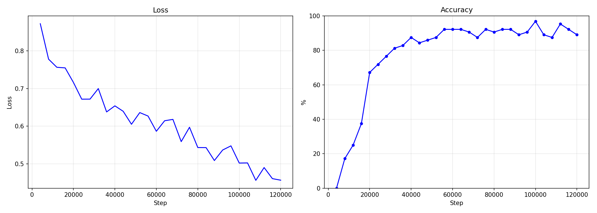
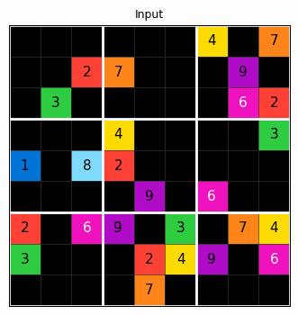

# URM — Universal Reasoning Model

A domain-agnostic implementation of the **Universal Reasoning Model (URM)** for solving logical reasoning tasks through iterative latent-space computation.

## Overview

The URM architecture learns to solve reasoning tasks through recursive refinement (8 loops) in a continuous latent space. The model treats every task as a **grid-to-grid transformation** — input grid in, solved grid out. Swap the data, not the code.

**Key Features:**
- **~14 million parameters** — reaches 96% accuracy on Sudoku Extreme
- **Domain-agnostic**: no task-specific code in the core architecture or training engine
- **Auto-detection**: grid dimensions, token count, and block structure are inferred from `.npy` files
- **On-the-fly augmentation**: unlimited diversity without pre-computed copies (∞ augments, zero extra storage)
- **Generic TTA**: test-time augmentation with weighted majority voting works for any grid domain
- Up to **~100× less GPU memory** than Transformer language models on equivalent tasks

## Results (Sudoku Extreme)

After 120k training steps: **96% accuracy** with TTA (8 augmentations).

Training time:
- ~14 hours on RTX 5060 Ti
- ~3.5 hours on RTX 5090

### Training Progress



### Example: AI Solving a Sudoku



## Changelog

### v3 - 01.03.2026
- Accuracy improved from 81% to **96%**

### v3 - 23.02.2026
- Sudoku Structural Encoding (learned row/col/block embeddings)
- Constraint Attention Bias (learnable attention bonus for cells sharing row/col/block)
- Loop Gate for fixed-point stability between reasoning segments
- Test-Time Augmentation (TTA) with digit relabeling + majority voting
- Dropout regularization (attention + MLP) to prevent overfitting
- Loop Noise between reasoning segments for robustness
- Best-model checkpoint tracking
- Gradient clipping
- Accuracy improved from 75% to **81%**

### v2 - 22.02.2026
- Removed Confusing Metrics
- Retrained on a RTX 5090 32GB

### v1 - 01.01.2026
- Muon Optimizer
- BF16 Training


## Project Structure

```
URM_Core.py                    — Core architecture (model, TTA, structural encoding, EMA)
train_URM.py                   — Generic training engine (dataset, loop, eval, checkpoints)
train_URM_Universal.py         — Universal grid domain (transforms, violations, encoding)
1_generate_sudoku_dataset.py   — Sudoku data converter (HuggingFace → .npy)
```

### Layer Responsibilities

```
┌─────────────────────────────────────────────────────────┐
│  URM_Core.py              NEVER MODIFY                  │
│  Model architecture, TTA framework, EMA, optimizers     │
├─────────────────────────────────────────────────────────┤
│  train_URM.py             NEVER MODIFY                  │
│  Training loop, dataset loading, checkpointing, eval    │
├─────────────────────────────────────────────────────────┤
│  train_URM_Universal.py   DOMAIN LAYER — edit or clone  │
│  Transforms, violations, structural encoding, drawing   │
├─────────────────────────────────────────────────────────┤
│  1_generate_*.py          DATA PREP — one per task      │
│  Downloads/converts raw data → universal .npy format    │
└─────────────────────────────────────────────────────────┘
```

## Rules & Conventions

### Data Format

Every task uses the same format. Place files in a directory:

```
data/my_task/
  train_inputs.npy    (N, H, W) uint8 — values in [0, K-1], 0 = blank/unknown
  train_labels.npy    (N, H, W) uint8 — target values (all cells filled)
  test_inputs.npy     (M, H, W) uint8
  test_labels.npy     (M, H, W) uint8
```

Everything is auto-detected from the arrays:

| Property | How Detected |
|---|---|
| Grid H×W | `array.shape[1], array.shape[2]` |
| num_tokens | `max(inputs, labels) + 1` |
| Blocks | Square grid where `√H` is integer (9→3×3, 16→4×4, 25→5×5) |

**No config files needed.** Just `.npy` arrays.

### Token Convention

| Value in .npy | Internal Token ID | Meaning |
|---|---|---|
| `0` | `1` | Blank / unknown cell |
| `1` | `2` | First digit or color |
| `K-1` | `K` | Last digit or color |
| — | `0` | Pad (internal only, never in data) |

The `+1` offset is applied automatically by the dataset loader. Token `0` (blank) is **never permuted** during augmentation — this is critical for correctness.

### Augmentation Rules

**CRITICAL: Token 0 (blank) must never be permuted.** Only tokens `1..K-1` participate in token relabeling. Permuting blank tokens corrupts the training data by turning unknown cells into digit cells, creating unsolvable puzzles.

Augmentation is applied on-the-fly during training:

| Transform | When Active | Purpose |
|---|---|---|
| Token permutation (1..K-1 only) | Always | Equivariance over token identity |
| Horizontal flip | Always | Spatial symmetry |
| Vertical flip | Always | Spatial symmetry |
| Transpose | Square grids only | Spatial symmetry |
| Band permutation | Blocks detected | Sudoku-style row band shuffling |
| Row-in-band permutation | Blocks detected | Rows within a band |
| Stack permutation | Blocks detected | Column stack shuffling |
| Col-in-stack permutation | Blocks detected | Columns within a stack |

### Inverse Transform Correctness

The `apply_transform` function must satisfy:

```
apply_transform(apply_transform(x, t, device, inverse=False), t, device, inverse=True) == x
```

The inverse builds the spatial permutation by **undoing forward steps in reverse order** (undo band/row/col → undo flip → undo transpose). The resulting flat permutation `fp` is used directly for both forward and inverse — no additional `argsort` needed.

### TTA & Violation Counting

Test-time augmentation generates multiple predictions under different transforms and combines them via **weighted majority voting**:

- Each prediction is inverse-transformed back to original space
- Constraint violations are counted (row/col/block duplicates)
- Weight: `5.0` if 0 violations, otherwise `max(0.5, 3.0 - 0.15 * v)`
- Perfect solutions get **10× higher vote weight** than bad ones

When no block structure is detected, `count_violations` returns 0 for all predictions (uniform weighting).

### Difficulty Mixing (Curriculum)

After step 5000, with 30% probability per batch, random blank cells are revealed (set to their label value). This creates easier sub-problems that help the model learn the **fixed point property** — maintaining correct answers once found. See Ren & Liu (2026) for why this matters.

## Adding a New Domain

To add a new task (e.g., Tetris, Snake, ARC):

**Step 1:** Create a data generation script `1_generate_tetris_dataset.py` that outputs:
```
data/tetris/
  train_inputs.npy  (N, H, W) uint8
  train_labels.npy  (N, H, W) uint8
  test_inputs.npy   (M, H, W) uint8
  test_labels.npy   (M, H, W) uint8
```

**Step 2:** Either use `train_URM_Universal.py` directly (works for any grid task), or clone it as `train_URM_Tetris.py` and customize:

| Callback | What to Customize |
|---|---|
| `count_violations` | Domain-specific constraint checking for better TTA weights |
| `random_transform` | Domain-specific symmetries beyond flip/transpose |
| `draw_output` | Visualization style |

**Step 3:** Train:
```bash
python train_URM_Universal.py --data_path data/tetris --lr_from 1e-4 --lr_to 4e-5
```

`train_URM.py` and `URM_Core.py` are **never modified**.

## Quick Start

**Requirements:** PyTorch 2.9+

```bash
pip install -r requirements.txt
```

### Training from Scratch

```bash
# 1. Generate Sudoku data
python 1_generate_sudoku_dataset.py --data_path data/sudoku --subsample 1000

# 2. Train
python train_URM_Universal.py --data_path data/sudoku --lr_from 1e-4 --lr_to 4e-5
```

Training auto-resumes from checkpoints. Delete `checkpoints/`, `graphs/`, `results/` to start fresh.

### Key Arguments

| Argument | Default | Description |
|---|---|---|
| `--steps` | 120000 | Total training steps |
| `--lr_from` / `--lr_to` | None | Linear LR schedule (overrides cosine) |
| `--batch_size` | 128 | Global batch size |
| `--eval_interval` | 4000 | Steps between evaluations |
| `--eval_loops` | 8 | Reasoning loops during eval |
| `--tta_augments` | 8 | TTA augmentations during eval |
| `--no_compile` | — | Disable torch.compile |
| `--no_ema` | — | Disable exponential moving average |
| `--no_augment` | — | Disable on-the-fly augmentation |

## References

- URM Paper: [arxiv.org/abs/2512.14693](https://arxiv.org/abs/2512.14693)
- Mechanistic Analysis (Ren & Liu): [arxiv.org/abs/2601.10679](https://arxiv.org/abs/2601.10679)
- Original Repository: [github.com/UbiquantAI/URM](https://github.com/UbiquantAI/URM)

## Citation

```bibtex
@misc{gao2025universalreasoningmodel,
      title={Universal Reasoning Model},
      author={Zitian Gao and Lynx Chen and Yihao Xiao and He Xing and Ran Tao and Haoming Luo and Joey Zhou and Bryan Dai},
      year={2025},
      eprint={2512.14693},
      archivePrefix={arXiv},
      primaryClass={cs.AI},
}
```

```bibtex
@misc{ren2026augmentedhrm,
      title={Are Your Reasoning Models Reasoning or Guessing?},
      author={Zirui Ren and Ziming Liu},
      year={2026},
      eprint={2601.10679},
      archivePrefix={arXiv},
      primaryClass={cs.AI},
}
```
